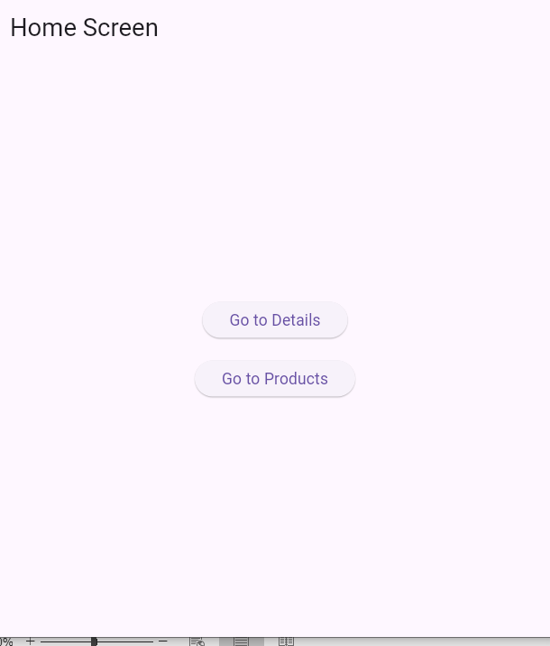
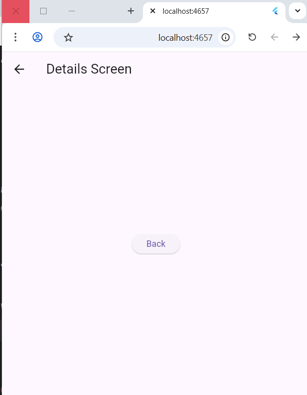
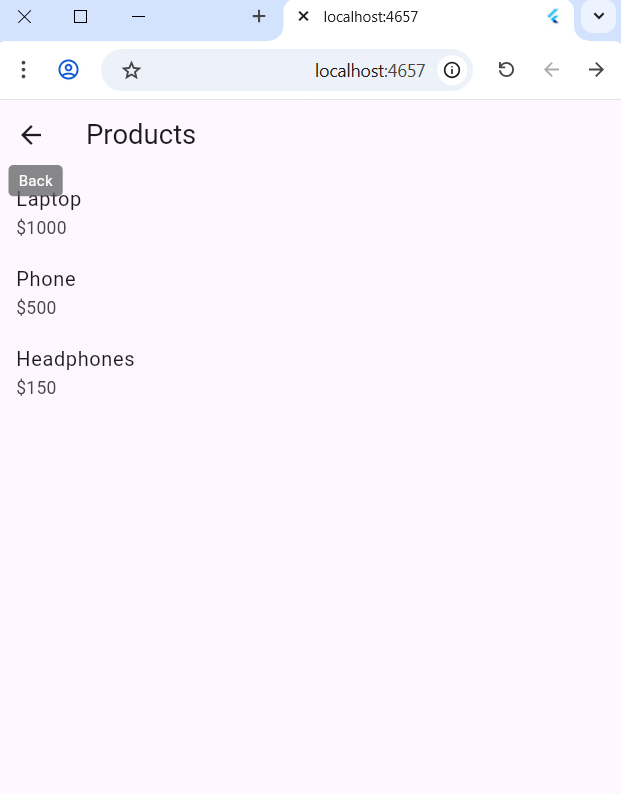

# 📱 Navigation App (Flutter Project)

## 👩‍💻 Student Information
**Name:** Khadega Sadeq Aldhabi  
**Level:** SE Level 3  
**Supervisor:** Omar Al-Saket  

---

## 📌 Project Overview

This Flutter project is a simple practice application that demonstrates the concepts of:

- Basic Stack Navigation (Push & Pop)
- Passing Data Between Screens
- Returning Data from Screens
- Displaying results using SnackBar

The project is designed to help understand how navigation works in Flutter in a clean and beginner-friendly way.

---

## 🚀 Features

### 1️⃣ Basic Navigation
- Navigate between Home Screen and Details Screen
- Use of `Navigator.push()` and `Navigator.pop()`

### 2️⃣ Passing Data
- Send product data (name, description, price) to the details screen
- Display received data dynamically

### 3️⃣ Returning Data
- Return a message from details screen back to products screen
- Show returned result using SnackBar

---

## 🖼️ Screenshots

> Add your screenshots here after running the app

### Home Screen

### Details Screen

### Products Screen

---

## 📂 Project Structure

lib/
│
├── main.dart
├── screens/
│ ├── home_screen.dart
│ ├── details_screen.dart
│ ├── products_screen.dart
│ └── product_details_screen.dart
│
└── models/
└── product.dart

---

## 🛠️ Technologies Used

- Flutter
- Dart
- Material Design
- Navigator (Routing System)

---

## 🎯 Learning Outcomes

- Understanding Flutter navigation system
- Passing data between screens
- Returning results between pages
- Improving UI design skills
- Organizing project structure properly

---
## 📌 Notes

This project is part of a university assignment focused on mastering Flutter navigation and state communication between screens.

---

## ✨ Thank You
